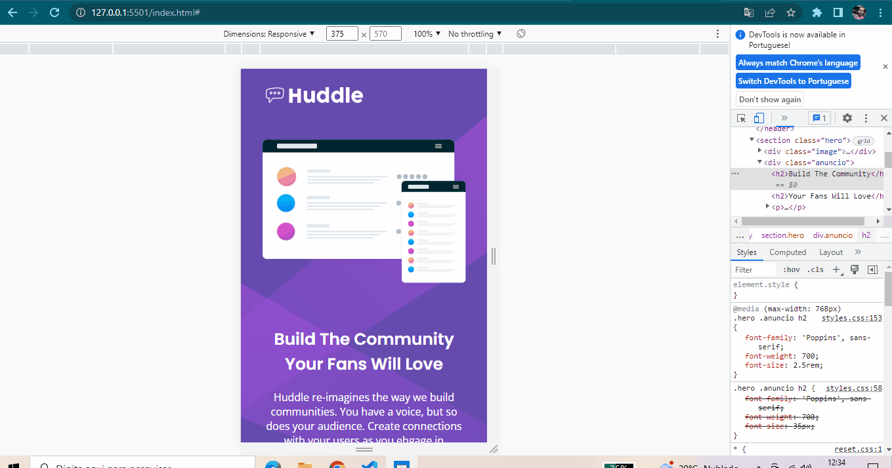

# huddle

Um desafio do Frontend Mentor proposto pelo Curso DevQuest - Dev em Dobro.

Objetivo testar os meus conhecimentos nas linguagens estudadas até então.

## Tecnologias Utilizadas:

- HTML;
- CSS;

## Tempo para conclusão:

Levei cercas de 3:00h para conclui-lo.

## Desafios:
Utilizar as tags, no HTML, nos lugares corretos, sem o exagero delas. Criar a responsividade para os demais tamanhos de telas. Usar as propriedade no CSS, nos seletores corretos.

